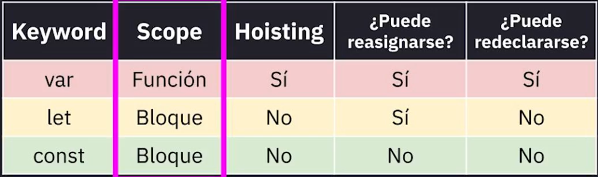

---

# Clase 23: Scope y Contextos de Ejecución en JavaScript

Entender el `scope` (alcance) y los contextos de ejecución en JavaScript es crucial para escribir código robusto, predecible y libre de errores. Estos conceptos definen cómo y dónde se puede acceder a las variables, y el entorno en el que se ejecuta nuestro código.

---

## 1. Contexto de Ejecución (Execution Context)

Un **contexto de ejecución** es el "entorno" abstracto donde el código JavaScript se evalúa y ejecuta. Cada vez que se ejecuta código, se hace dentro de un contexto de ejecución.

Existen principalmente dos tipos de contextos:

-   **Contexto de Ejecución Global:** Es el contexto base, el primero que se crea. Cualquier código que no esté dentro de una función pertenece a este contexto.
-   **Contexto de Ejecución de Función:** Cada vez que se invoca una función, se crea un nuevo contexto de ejecución para esa función.

---

## 2. Scope (Alcance)

El **scope** determina la accesibilidad y visibilidad de las variables y funciones en diferentes partes del código. En esencia, responde a la pregunta: "¿Desde dónde puedo acceder a esta variable?".

### Tipos de Scope

-   **Scope Global:** Las variables declaradas fuera de cualquier función tienen un scope global. Se puede acceder a ellas desde cualquier parte del programa.

    ```javascript
    var nombreGlobal = "Soy accesible en todas partes";

    function miFuncion() {
      console.log(nombreGlobal); // "Soy accesible en todas partes"
    }
    miFuncion();
    console.log(nombreGlobal); // "Soy accesible en todas partes"
    ```

-   **Scope de Función:** Las variables declaradas con `var` dentro de una función solo son visibles y accesibles dentro de esa función.

    ```javascript
    function miFuncion() {
      var nombreLocal = "Solo soy visible aquí dentro";
      console.log(nombreLocal); // "Solo soy visible aquí dentro"
    }
    miFuncion();
    // console.log(nombreLocal); // Error: nombreLocal is not defined
    ```

-   **Scope de Bloque:** Introducido en ES6 con `let` y `const`. Las variables declaradas con estas palabras clave solo existen dentro del bloque (`{...}`) en el que fueron definidas (ej. un `if`, un `for`, o simplemente un par de llaves).
    ```javascript
    if (true) {
      let variableDeBloque = "Solo existo en este bloque if";
      console.log(variableDeBloque); // "Solo existo en este bloque if"
    }
    // console.log(variableDeBloque); // Error: variableDeBloque is not defined
    ```

### Scope Chain (Cadena de Scope)

Cuando se necesita acceder a una variable, JavaScript la busca siguiendo un orden específico, conocido como la **Cadena de Scope**.

1.  **Scope Actual:** Primero, busca la variable en el contexto de ejecución actual (ej. dentro de la función en la que estás).
2.  **Scope Externo:** Si no la encuentra, busca en el scope del contexto "padre" (la función que contiene a la función actual, por ejemplo).
3.  **Repetición:** El proceso se repite, subiendo en la cadena de scopes hasta llegar al scope global.
4.  **Error:** Si la variable no se encuentra después de buscar en el scope global, JavaScript arroja un error de referencia (`ReferenceError`).

---

## 3. Declaración de Variables: `var`, `let` y `const`

La forma en que declaramos una variable (`var`, `let`, o `const`) tiene un impacto directo en su scope y comportamiento, como el *hoisting* (elevación) y la reasignación.

La siguiente tabla resume sus diferencias  clave (sacada de la clase 23 del curso de fundamentos de JavaScript de Platzi):



> **¿Qué es Hoisting?** Es un comportamiento de JavaScript donde las declaraciones de variables (`var`) y funciones son "movidas" al principio de su scope antes de la ejecución del código. Esto permite usar una variable antes de haberla declarado, aunque su valor será `undefined`. `let` y `const` también son "elevadas" pero no inicializadas, creando una "zona muerta temporal" que provoca un error si se intenta acceder a ellas antes de su declaración.

---

## Conclusiones y Buenas Prácticas

-   Comprender el scope es fundamental para evitar bugs donde las variables se sobreescriben o no son accesibles cuando se espera que lo sean.
-   El scope de bloque (`let` y `const`) ofrece un control mucho más granular y predecible que el scope de función (`var`).
-   **Recomendación moderna:** Prioriza el uso de `const` por defecto. Usa `let` solo cuando sepas que necesitarás reasignar el valor de la variable. **Evita el uso de `var`** en código nuevo para prevenir comportamientos inesperados relacionados con el hoisting y el scope de función.