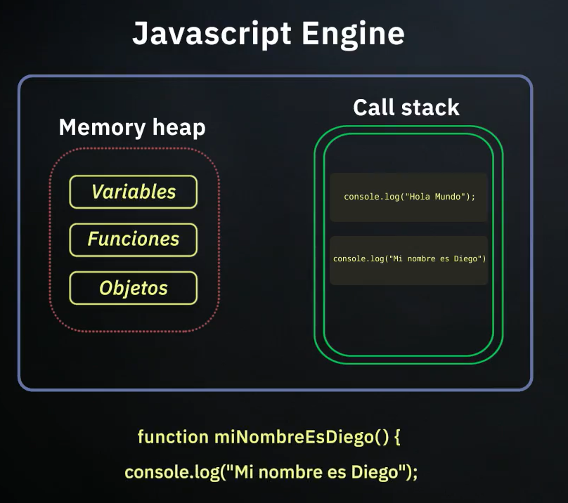
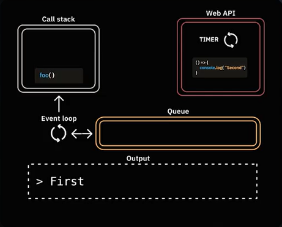

# 🌀 Sincronía y Asincronía en JavaScript: Entendiendo el Event Loop

JavaScript es un lenguaje de programación de un solo hilo (*single-threaded*), lo que significa que solo puede ejecutar una tarea a la vez. Para manejar operaciones que toman tiempo (como peticiones a un servidor, timers o eventos del usuario) sin bloquear el hilo principal, JavaScript utiliza un modelo asíncrono.

Entender la diferencia entre el código **síncrono** y **asíncrono** es fundamental para crear aplicaciones web fluidas y eficientes.

## ➡️ El Modelo Síncrono: Una Tarea a la Vez

Por defecto, JavaScript ejecuta el código de manera síncrona. Esto significa que lee y ejecuta las instrucciones línea por línea, una tras otra. No pasará a la siguiente tarea hasta que la actual haya terminado.

Para gestionar esto, el **Motor de JavaScript** (como el V8 de Google Chrome) utiliza dos componentes principales:

1.  **Memory Heap (Montón de Memoria):** Es una región de memoria no estructurada donde se almacenan todas las variables, funciones y objetos que definimos en nuestro código.
2.  **Call Stack (Pila de Llamadas):** Es una estructura de datos que registra en qué parte del programa estamos. Si ejecutamos una función, se añade a la parte superior de la pila. Cuando la función termina y retorna, se elimina de la pila.



En el diagrama anterior, el `Call Stack` ejecuta las instrucciones en orden:
1.  `console.log("Hola Mundo")` se añade a la pila, se ejecuta y se elimina.
2.  `console.log("Mi nombre es Diego")` se añade, se ejecuta y se elimina.

> **El problema del bloqueo:** Si una función en el Call Stack tarda mucho en completarse (por ejemplo, una operación de red compleja), bloqueará todo el hilo. La página web se congelará y no responderá a las interacciones del usuario hasta que la tarea termine.

## ⚡ El Modelo Asíncrono: No Más Bloqueos

Aquí es donde la magia ocurre. Para evitar el bloqueo, JavaScript delega ciertas tareas a un entorno más grande que el propio Motor de JS (como el navegador o Node.js). Este entorno proporciona herramientas adicionales para manejar la asincronía.

Los componentes clave de este modelo son:

*   **Web APIs (APIs del Navegador):** Son funcionalidades que el navegador proporciona y a las que JavaScript puede acceder. Incluyen el DOM, AJAX (`fetch`), y temporizadores como `setTimeout`. Cuando el Call Stack encuentra una operación asíncrona, se la entrega a la Web API correspondiente y continúa con la siguiente tarea, liberando la pila.
*   **Callback Queue (Cola de Tareas):** Una vez que la Web API termina su trabajo (por ejemplo, el temporizador de `setTimeout` concluye), la función que se le pasó (el *callback*) no se ejecuta inmediatamente. En su lugar, se coloca en la Callback Queue, esperando su turno.
*   **Event Loop (Bucle de Eventos):** Este es el corazón del modelo asíncrono. Su trabajo es simple pero crucial: **vigila constantemente si el Call Stack está vacío**. Si lo está, toma la primera tarea de la Callback Queue y la empuja al Call Stack para que se ejecute.



Este ciclo (Call Stack -> Web API -> Callback Queue -> Event Loop -> Call Stack) permite que JavaScript maneje tareas largas en segundo plano sin congelar la interfaz de usuario.

### Ejemplo Práctico

Analicemos qué sucede con este código:

```javascript
console.log("Inicia el script"); // 1. Se añade al Call Stack y se ejecuta inmediatamente.

setTimeout(() => {
    // 4. Esta función (callback) es la última en ejecutarse.
    console.log("¡Tarea asíncrona completada!"); 
}, 2000); // 2. Se añade al Call Stack, se pasa a la Web API (Timer) y se elimina del Stack.

console.log("El script ha terminado"); // 3. Se añade al Call Stack y se ejecuta.
```

El flujo de ejecución es el siguiente:

1.  `console.log("Inicia el script")` se ejecuta. La consola muestra "Inicia el script".
2.  `setTimeout` es enviado a la Web API del navegador, que inicia un temporizador de 2 segundos. El Call Stack queda libre.
3.  `console.log("El script ha terminado")` se ejecuta. La consola muestra "El script ha terminado".
4.  El Call Stack ahora está vacío.
5.  Después de 2 segundos, la Web API mueve el callback `() => { ... }` a la Callback Queue.
6.  El Event Loop ve que el Call Stack está vacío y hay una tarea en la cola, así que la mueve al Call Stack.
7.  El callback se ejecuta. La consola muestra "¡Tarea asíncrona completada!".

## ✅ Conclusión: ¿Por Qué es Tan Importante?

Comprender este modelo es esencial para cualquier desarrollador de JavaScript moderno.

*   **Sincronía:** Es el comportamiento por defecto, secuencial y bloqueante.
*   **Asincronía:** Es el mecanismo para realizar tareas largas sin congelar la aplicación, creando una experiencia de usuario fluida y receptiva.

Dominar el flujo del Event Loop te permite manejar eficazmente peticiones a APIs (`fetch`), eventos de usuario (clics, scrolls) y cualquier otra operación que no tenga un resultado inmediato, convirtiéndote en un desarrollador más competente y capaz de construir aplicaciones robustas.